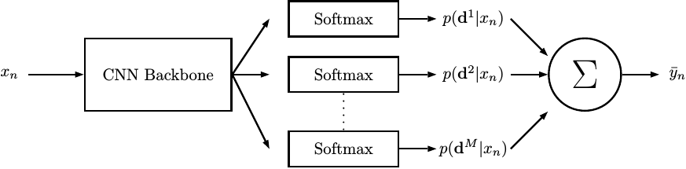

# Deep Ordinal Regression with Label Diversity




[](https://paperswithcode.com/sota/head-pose-estimation-on-biwi?p=deep-ordinal-regression-with-label-diversity)

[](https://paperswithcode.com/sota/age-estimation-on-utkface?p=deep-ordinal-regression-with-label-diversity)

[](https://paperswithcode.com/sota/historical-color-image-dating-on-hci?p=deep-ordinal-regression-with-label-diversity)

This is the official codebase for the implementation of **[Deep Ordinal Regression with Label Diversity](https://arxiv.org/abs/2006.15864)**, presented at ICPR2020.

Code author: Axel Berg

## Dependencies
* Matlab 2020a with the Deep Learning Toolbox
* Cuda 10.1

## Dataset Preparation

### UTKFace Dataset
Download the aligned and cropped images from https://susanqq.github.io/UTKFace/ and run `age/data/createCroppedUtkDataset.m` after setting the correct path to the dataset in the script.

This will create datastore objects for reading the images.

The train/test split is the same as the one used in "Coral-CNN" and can be found here: https://github.com/Raschka-research-group/coral-cnn

### Biwi Dataset
We use protocol 2 as described in the FSA-Net paper, which uses a 70-30 train/test split. You can prepare the dataset yourself using the original code from https://github.com/shamangary/FSA-Net and store the train/test splits as `.mat`-files.

### Historical Images Dataset
Download the dataset from http://graphics.cs.cmu.edu/projects/historicalColor/ and add it set the datapath variable in `date/dateParameters.m` to point to it.

## Training and Evaluation
For each dataset, run the iteration scripts to train the ResNet50 backbone for 10 iterations and output save the mean average error results on the test set in a text file. All the hyperparameters are the same for each method and are defined in a single function.

The following loss functions are supported:

* L2 - use the standard L2 (mean squares error) loss. This is the regression baseline
* CE -  use the cross entropy loss. This is the RvC baseline.
* Equal Bins - use the equal bins label diversity method
* Random Bins - use the random bins label diversity methods.
* Multiple bins (for the HCI dataset) - uses the multiple bins labels diversity method specified in the paper

## Citation

If you find this work useful, please cite our paper:
````
@inproceedings{berg2021deep,
  title={Deep ordinal regression with label diversity},
  author={Berg, Axel and Oskarsson, Magnus and O'Connor, Mark},
  booktitle={2020 25th International Conference on Pattern Recognition (ICPR)},
  pages={2740--2747},
  year={2021},
  organization={IEEE}
}
````

## References

W. Cao, V. Mirjalili, and S. Raschka (2019). [Consistent rank logits for ordinal regression with convolutional neural networks](https://arxiv.org/abs/1901.07884v1). arXiv preprint arXiv:1901.07884

T.-Y. Yang, Y.-T. Chen, Y.-Y. Lin, and Y.-Y. Chuang, (2019) [Fsa-net: Learning
fine-grained structure aggregation for head pose estimation from a single
image](https://github.com/shamangary/FSA-Net/blob/master/0191.pdf)
